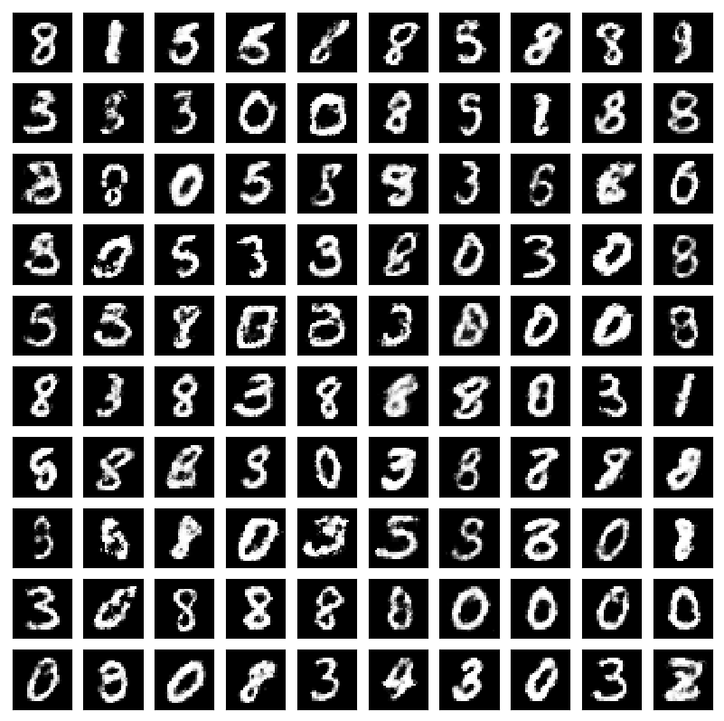
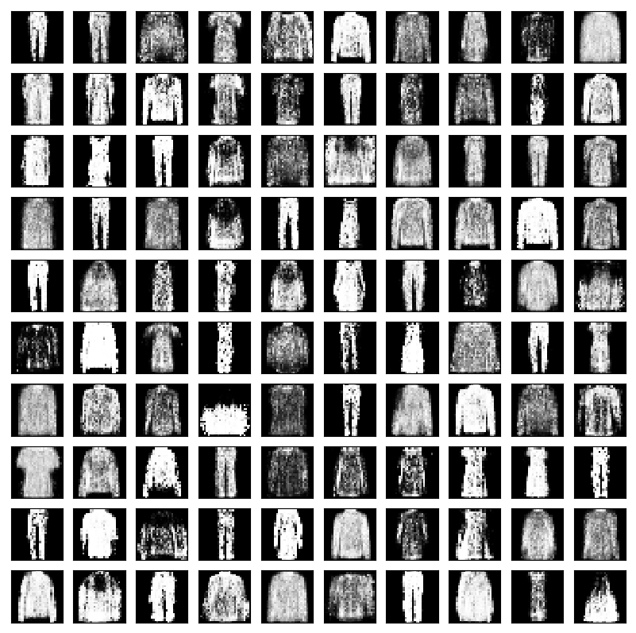

# Minimal GAN in TensorFlow - 101 + 10 lines
This is an implementation of a Generative Adversarial Network (GAN) in [TensorFlow](http://tensorflow.org). The example is based on the original work from [Goodfellow et. al. ](https://arxiv.org/abs/1406.2661), where the generator learns to reconstruct samples from the [MNIST](http://yann.lecun.com/exdb/mnist/) dataset.

## Dependencies
The code has been tested in [TensorFlow](http://tensorflow.org) 1.4 (Python 3.6, CPU, macOS). It should work in other platforms as well. Also, it makes use of  [TensorFlow-Slim](https://github.com/tensorflow/tensorflow/tree/master/tensorflow/contrib/slim).

## Execution

Run the following script:

    $ python gan.py mnist
    $ python gan.py fashion-mnist

The results of MNIST after ~200k iterations should look like the following:

The result of fahsion-MNIST after ~300k iterations, should like the following:

## Acknowledgement
Two helpful repositories with several GAN implmentations are [wiseodd](https://github.com/wiseodd/generative-models) and [hwalsuklee](https://github.com/hwalsuklee/tensorflow-generative-model-collections). This implementation drew inspiration from the aformentioned repositories.

## License
Copyright (c) 2020, Vasileios Belagiannis
All rights reserved.

Redistribution and use in source and binary forms, with or without
modification, are permitted provided that the following conditions are met:

* Redistributions of source code must retain the above copyright notice, this
  list of conditions and the following disclaimer.

* Redistributions in binary form must reproduce the above copyright notice,
  this list of conditions and the following disclaimer in the documentation
  and/or other materials provided with the distribution.

THIS SOFTWARE IS PROVIDED BY THE COPYRIGHT HOLDERS AND CONTRIBUTORS "AS IS" AND ANY EXPRESS OR IMPLIED WARRANTIES, INCLUDING, BUT NOT LIMITED TO, THE IMPLIED WARRANTIES OF MERCHANTABILITY AND FITNESS FOR A PARTICULAR PURPOSE ARE DISCLAIMED. IN NO EVENT SHALL THE COPYRIGHT HOLDER OR CONTRIBUTORS BE LIABLE FOR ANY DIRECT, INDIRECT, INCIDENTAL, SPECIAL, EXEMPLARY, OR CONSEQUENTIAL DAMAGES (INCLUDING, BUT NOT LIMITED TO, PROCUREMENT OF SUBSTITUTE GOODS OR SERVICES; LOSS OF USE, DATA, OR PROFITS; OR BUSINESS INTERRUPTION) HOWEVER CAUSED AND ON ANY THEORY OF LIABILITY, WHETHER IN CONTRACT, STRICT LIABILITY, OR TORT (INCLUDING NEGLIGENCE OR OTHERWISE) ARISING IN ANY WAY OUT OF THE USE OF THIS SOFTWARE, EVEN IF ADVISED OF THE POSSIBILITY OF SUCH DAMAGE.
